# Word Guessing Game

Word guessing game is for everyone who are curios and quick performer. they can play this game simply by filling the given blank squer with requierd word according to thier own intuitive and guesses. the user will be ask for example to fill in the blank a city of ireland wich incoporate 4 words, if they guess accordingly and write down the exact work they will pass the game if not they will bw failed.

Word guessing game is developed in purpose to improve memory and has a memory boosting fuction.

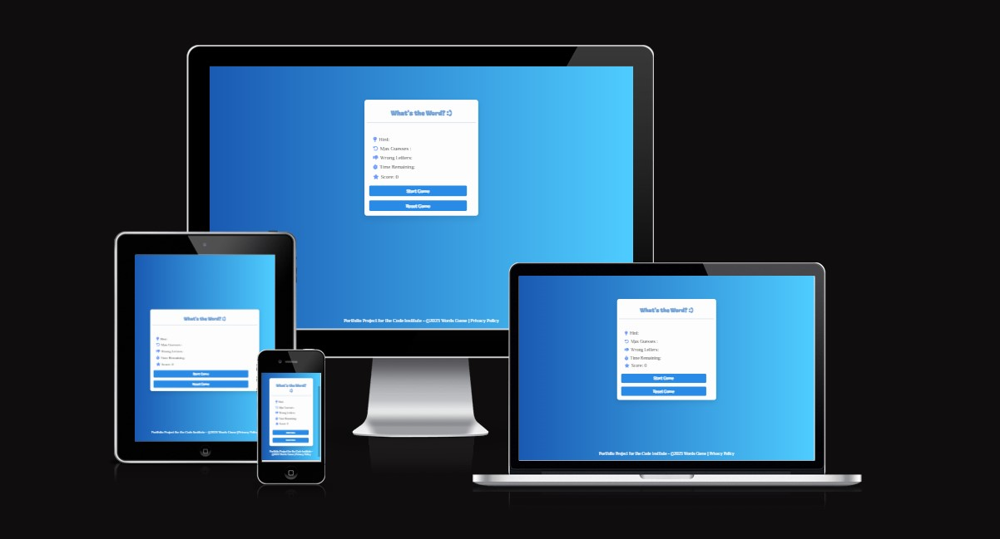

## Features

### _Existing Features_

There are many feature available in this app that can help the player to guess faster and better like: 

- **Hint:** The Hint option provides a clue to guess accodingly. 
- **Remaining Guess:** The Remaining Guess show the chance of making wrong guess. 
- **Worng letter:** Worng letter option which assist player to avoid wrong guess.
- **Reset Game Button:** The Reset button , it restart the game.
- **Start Game Button:** The "Start Game" button feature offers users the ability to initiate the word guessing game at their discretion. Upon clicking the button, the game timer begins counting down from the specified duration, and the game's hint becomes visible. Additionally, the button becomes visually disabled, signaling to users that the game has commenced and preventing repeated clicks until the current round concludes. This intuitive feature enhances user engagement and control over the game experience.
- **Player Score:** The player score feature enhances the game by awarding points for correct word guesses. It introduces an element of competitiveness and skill, encouraging players to aim for higher scores. It will reset when user reset the game.
- **Timer:** The game timing feature introduces a 30-second countdown to each word guess, enhancing excitement and challenge. Players must think quickly, adding an element of urgency and fostering focused decision-making. This dynamic gameplay creates engaging rounds with immediate feedback on remaining time, while also promoting adaptive strategies and streamlined play.
- **Answer:** Another features is that when the game is over the answer will appear on alert message.

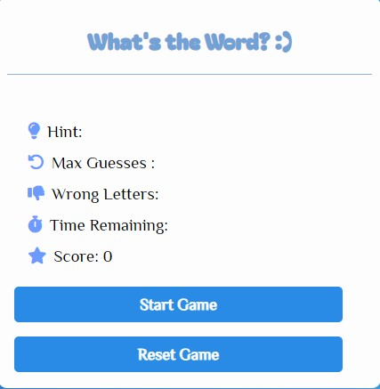

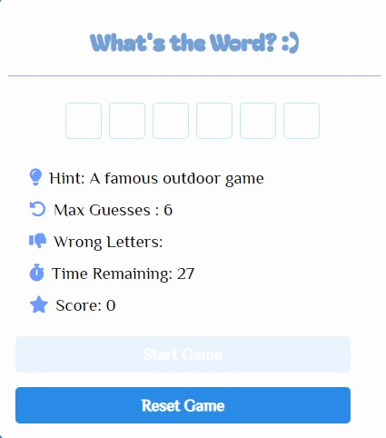

**_Timer in different Cases:_**

1. Timer will stop when users found the word

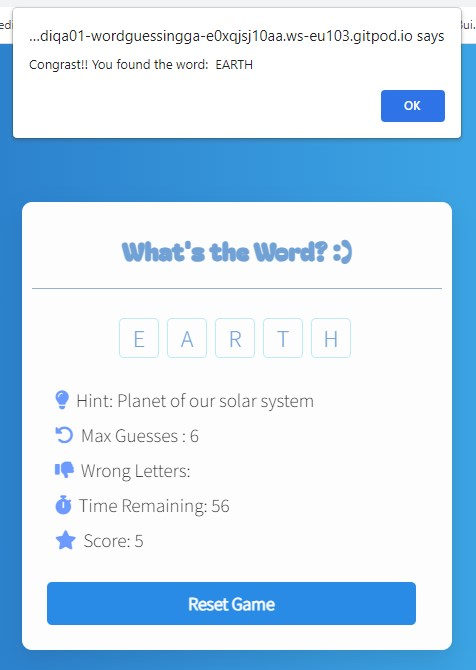

2. Timer will stop when user run out of "Max Guesses"

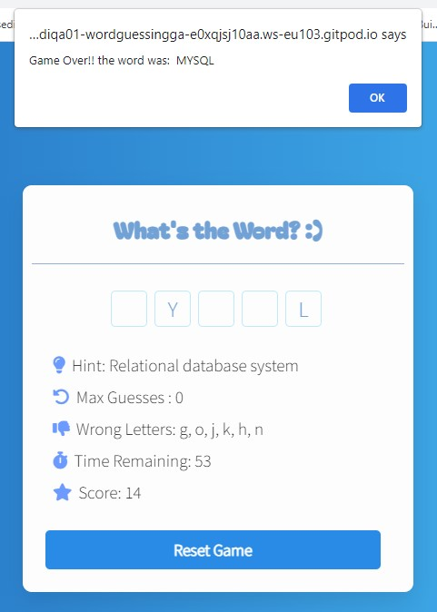

3. When uer run out of 30 sec,

**Note:** If the user types a wrong letter several times, this repetition does not reduce the number of "Max Guess" that the user has.  And the worng typed letter is shown only once in the list of wrong letters list..

   
### _Features Left to Imlement_
Non so far.

## Testing

- I tested that this game works in different browsers : Chrome , Firefox , Safari . 
- I confirmed that this project is responsive , looks good and functions on all standard screen sizes using the devtools device toolbar .
- I confirmed that the reset button works correct.

**Note:** This game has been written with Javascript knowledge I possess at this moment in time. I am, aware that there might be more better ways/functions I could use, so I'm planning on revisiting this at a later stage when I have a better and more in-depth grasp of the subject.

## Bugs
### _Solved Bugs_

1. When I deployed my project on Github page , I discovered there are few errors on console that caused every time the page loads I see the unstyled content for a split-second, then everything settles in. 

- I discovered the flash of unstyled content was  in Firefox only.
I'm not seeing this issue in any other browser that I've tested - IE, Chrome, Opera .. I just add few lines of code on the head of html file. 

        <link href="https://fonts.googleapis.com/icon?family=Material+Icons" rel="stylesheet">
        <link rel="preconnect" href="https://fonts.googleapis.com">
        <link rel="preconnect" href="https://fonts.gstatic.com" crossorigin>
        <link href="https://fonts.googleapis.com/css2?family=Spinnaker&display=swap" rel="stylesheet">

2. When I deployed my project on Github page , I noticed that there is also another error in console because I had forgotten to add favicon, however this error didnt affect the application proformance but I added it just in case to not have any errors in console.

- I just added this line of code in the head of html file.

        <link rel="shortcut icon" type="image/x-icon" href="favicon.ico">

### _Unfixed Bugs_

- When I was testing the timer, I noticed that when user go to another tab from the game page in the browser when the game is over and timer round is 0,the timer refreshes and starts over until the timer stops when 30 seconds are up or user click rest game button.  Although this bug does not broken the game work, it is poor in terms of user experience. I could not solve this bug, so I am documenting it here.

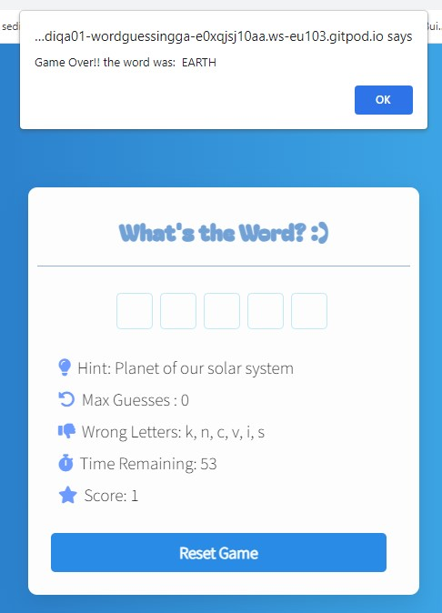

- While testing the game on different devices, I realized that the typed letters were not displaying in the input fields on mobile devices. To address this issue, I implemented an event listener for the text input field that ensures the typed letters are correctly displayed in the input fields on mobile devices. However, this solution inadvertently led to a performance issue, as the typed letters were no longer displaying on desktop devices as well. so I documented as unfixed bug.

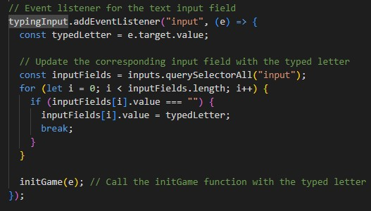

## What's New? 😃
In this section, you can explore the exciting updates to the project.

### _Font Awesome Icons_ 
To enhance the user interface, Font Awesome icons have been incorporated, adding visual appeal and usability.
### _Refreshing Colors_ 
The background image has been replaced with a pleasing light blue background, improving site loading speed. The use of the `linear-gradient` property brings a gradient effect reminiscent of the previous background image. This delightful color has also been extended to the buttons for a harmonious look.
### _Start Game Button_ 
Introducing the "Start Game" button! Users can now kick off their word-guessing adventure with a simple click, triggering the game timer and engaging gameplay.
### _Game Timing_
The game timing feature adds an element of challenge and excitement. Players are given a fixed time of 30 seconds for each word guess, enhancing the gameplay experience.
### _Player Score_
The player score feature has been implemented to track and display the user's progress. Correct guesses lead to an increment in score, while wrong guesses are handled thoughtfully to maintain a fair and enjoyable experience.

## Validator Testing

### _HTML_
- No errors were returned when passing through the official W3C validator.

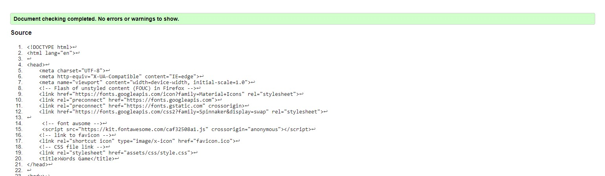

### _CSS_
- No errors were found when passing through the official (Jigsaw) validator.

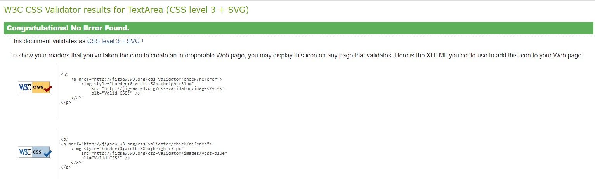

### _JS_
- No issues were found through JS Hint.

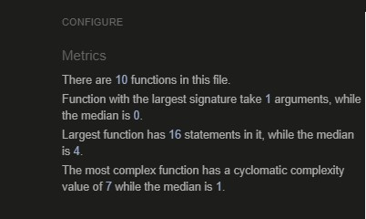

### _Lighthouse_
The page achieved great performance.

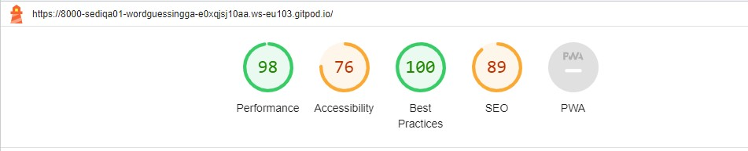

Note: I added a semantic structure in the code using LMS, but when I was validating the html code, it got an error in section tags and suggested to use div tag instead of section.

## Libraries & Programs 

- **Github -** to store my repository
- **Gitpod -** to create my project files
- **Google Fonts -** for my font family 'Source Sans Pro'
- **Favicon -** for my project icons
- **AmIResponsive? -** To check site responsivness
- **Dev Tools -** to ensure the site looked good across different devices
- **Font Awsome Icon -** provied game icons.

## Deployment

The site was deployed to GitHub pages. The steps to deploy are as follows:

* In the GitHub repository, navigate to the Settings tab. On the left-hand side under ‘Code and automation’, select ‘Pages’ and from the source section drop-down menu, select the Main Branch. Once the main branch has been selected, the page will be automatically refresh with a detailed ribbon display to indicate the successful deployment. The live link can be found here
[Word Guessing Game](https://sediqa01.github.io/Word-Guessing-Game/)

## Credits

For JavaScript issues I encountered these sites have been used for reference:

- For general information [W3 Schools](https://www.w3schools.com/) and [Developer Mozilla](https://developer.mozilla.org/)
- I used [CodeNepal](https://www.codingnepalweb.com/) site as main guide and followed CodeNepal YouTube step by step.
- I used this sit to add disabled stayle for start btn disable mode [Smart Devpreneur](https://smartdevpreneur.com/easily-disable-a-button-with-javascript-or-css-3-examples/)
- For Media Query, and color picker I used [W3 Schools](https://www.w3schools.com/)

## Media 
- Image for favicon taken from [iconfinder](https://www.iconfinder.com/search?q=word%20game)

