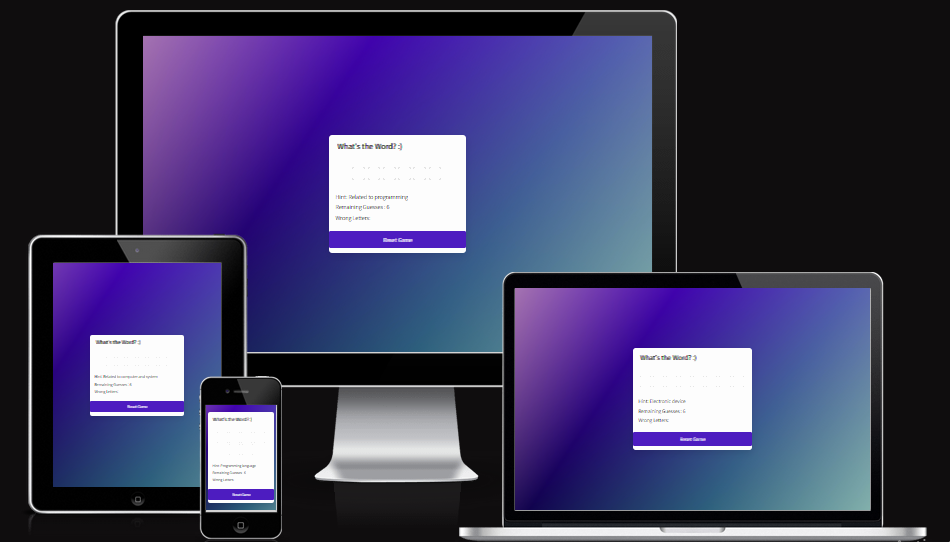
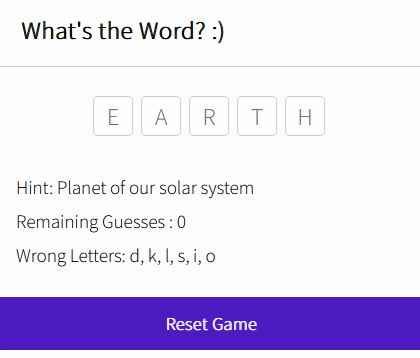
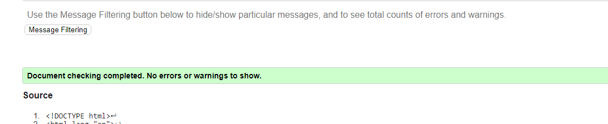
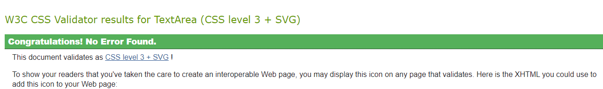
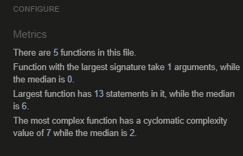
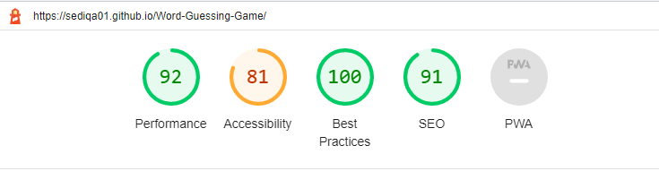

# Word Guessing Game

Word guessing game is for everyone who are curios and quick performer. they can play this game simply by filling the given blank squer with requierd word according to thier own intuitive and guesses. the user will be ask for example to fill in the blank a city of ireland wich incoporate 4 words, if they guess accordingly and write down the exact work they will pass the game if not they will bw failed.

Word guessing game is developed in purpose to improve memory and has a memory boosting fuction.

# Features

 ### Existing Features

   There are many feature available in this app that can help the player to guess faster and better like: 

- **Hint** The Hint option provides a clue to guess accodingly. 
- **Remaining Guess** The Remaining Guess show the chance of making wrong guess. 
- **Worng letter** Worng letter option which assist player to avoid wrong guess.
- **Reset Button** The Reset button , it restart the game.
- **Answer** Another features is that when the game is over the answer will appear on inputs squer.

### Features Left to Imlement
When there is time ,I'd like to expand this Game to include player score and timing.

# Testing

- I tested that this game works in different browsers : Chrome , Firefox , Safari . 
- I confirmed that this project is responsive , looks good and functions on all standard screen sizes using the devtools device toolbar .
- I confirmed that the reset button works correct.

**Note:** This game has been written with Javascript knowledge I possess at this moment in time. I am, aware that there might be more better ways/functions I could use, so I'm planning on revisiting this at a later stage when I have a better and more in-depth grasp of the subject.

## Bugs

### Solved Bugs

1. When I deployed my project on Github page , I discovered there are few errors on console that caused every time the page loads I see the unstyled content for a split-second, then everything settles in. 

- I discovered the flash of unstyled content was  in Firefox only.
I'm not seeing this issue in any other browser that I've tested - IE, Chrome, Opera .. I just add few lines of code on the head of html file. 

        <link href="https://fonts.googleapis.com/icon?family=Material+Icons" rel="stylesheet">
        <link rel="preconnect" href="https://fonts.googleapis.com">
        <link rel="preconnect" href="https://fonts.gstatic.com" crossorigin>
        <link href="https://fonts.googleapis.com/css2?family=Spinnaker&display=swap" rel="stylesheet">

2. When I deployed my project on Github page , I noticed that there is also another error in console because I had forgotten to add favicon, however this error didnt affect the application proformance but I added it just in case to not have any errors in console.

- I just added this line of code in the head of html file.

        <link rel="shortcut icon" type="image/x-icon" href="favicon.ico">

## Validator Testing

### HTML
- No errors were returned when passing through the official W3C validator.

### CSS

- No errors were found when passing through the official (Jigsaw) validator.

### JS

- No issues were found through JS Hint.

### Lighthouse

The page achieved great performance.

# Libraries & Programs 

    - Github, to store my repository
    - Gitpod, to create my project files
    - Google Fonts, for my font family 'Source Sans Pro'
    - Favicon, for my project icons
    - Am I Responsive?
    - Dev Tools, to ensure the site looked good across different devices

### Unfixed Bugs

No unfixed bugs have been found.

# Deployment

The site was deployed to GitHub pages. The steps to deploy are as follows:

In the GitHub repository, navigate to the Settings tab. On the left-hand side under ‘Code and automation’, select ‘Pages’ and from the source section drop-down menu, select the Main Branch. Once the main branch has been selected, the page will be automatically refresh with a detailed ribbon display to indicate the successful deployment. The live link can be found here
[Word Guessing Game](https://sediqa01.github.io/Word-Guessing-Game/)

# Credits

For JavaScript issues I encountered these sites have been used for reference:

- For general information [W3 Schools](https://www.w3schools.com/) and [Developer Mozilla](https://developer.mozilla.org/)
- I used [CodeNepal](https://www.codingnepalweb.com/) site as main guide and followed CodeNepal YouTube step by step.
- For guidance I looked at these tutorials on Youtube
  - https://www.youtube.com/watch?v=Dgp0tEKJj-g
  - https://www.youtube.com/watch?v=N5T1lA2jsmM
- For Media Query I used [W3 Schools](https://www.w3schools.com/)

## Media 
- Background image have been taken from  [Pexel](https://www.pexels.com/) site.
- Image for favicon taken from [iconfinder](https://www.iconfinder.com/search?q=word%20game)

